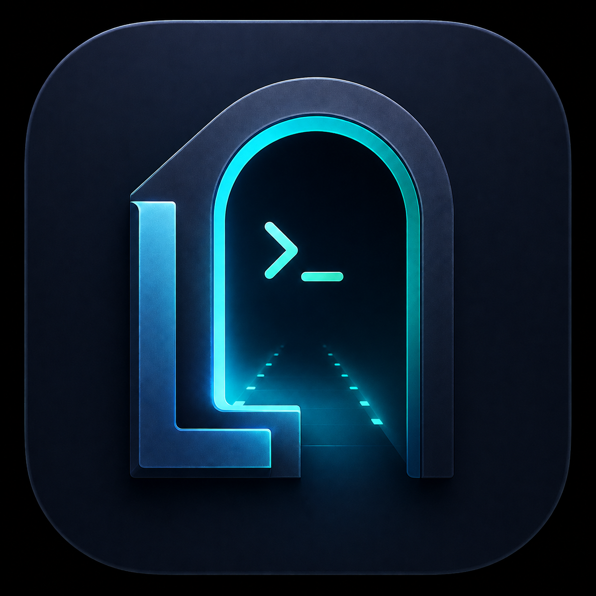
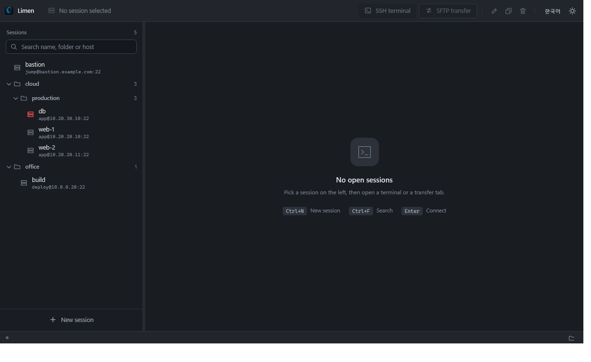

<div align="center">



# Limen

**서버를 기억하는 Windows SSH 클라이언트.**

터미널, SFTP 탐색기, 자격 증명 저장을 한 창에서. 설치도 계정도 텔레메트리도 없습니다.

[다운로드](../../releases) · [English](README.md)

</div>

---



라틴어 *limen* — 문지방. 이쪽에서 저쪽으로 건너가는 지점.

## 빌드

```
git clone https://github.com/LJW1216/limen-ssh
cd limen-ssh
dotnet build src/Limen/Limen.csproj
```

.NET 10 SDK가 필요합니다. 단일 파일 배포본:

```
dotnet publish src/Limen/Limen.csproj -c Release -r win-x64 ^
  --self-contained true -p:PublishSingleFile=true ^
  -p:IncludeNativeLibrariesForSelfExtract=true -o outputs/Limen
```

## 보안 — 솔직하게

비밀번호와 키 암호는 현재 Windows 사용자로 범위가 제한된 DPAPI로 암호화합니다.
다른 PC나 다른 Windows 계정에서는 복호화되지 않습니다. 뒤집어 말하면,
**로그인된 당신의 세션에서 코드를 실행할 수 있는 사람은 누구든 복호화할 수 있습니다.**
마스터 비밀번호는 없습니다. 그 거래가 마음에 들지 않으면 비밀번호 칸을 비워 두세요.
접속할 때마다 물어봅니다.

호스트 키는 TOFU 방식입니다. 첫 접속 때 SHA256 지문을 보여주고, 승인하면 저장하고,
이후 달라지면 통신 전에 경고합니다.

---

```
용도
----
GUI SSH 터미널과 GUI SFTP 파일 전송을 하나의 창에서 제공합니다.
세션(호스트/포트/사용자/비밀번호)을 저장해 두고 클릭 한 번으로 접속합니다.
FTP 클라이언트나 FTP 프로토콜 구현은 포함되어 있지 않습니다.

0.0.1 초기 공개
---------------
- 이름을 SSH Session Bridge 에서 Limen 으로 바꿨습니다. 설정 저장 위치도
  %APPDATA%\Limen 으로 옮겨졌습니다.
- 화면 전체를 다시 그렸습니다. 다크/라이트 테마가 제목 표시줄과 터미널 색까지
  함께 바뀝니다.
- 세션마다 색을 지정해 목록·탭·터미널 상단에 표시합니다. 운영 서버 오인 방지용입니다.
- SSH 탭 아래에 CPU·메모리·GPU·디스크 사용률이 실시간으로 표시됩니다.
  75% 부터 주황, 90% 부터 빨강으로 바뀝니다.
- 터미널 검색(Ctrl+F), 글자 크기 조절(Ctrl+휠), 세션 기록 저장을 추가했습니다.
- 여러 줄 붙여넣기는 실행 전에 내용을 확인합니다.
- SFTP 에 이름 바꾸기(F2), 권한 변경, 우클릭 메뉴를 추가했습니다.
- 창 위치와 크기를 기억합니다.

화면 구성
---------
위쪽  : 선택한 세션 정보와 실행 버튼(SSH 터미널 / SFTP 전송), 편집·복제·삭제, 테마 전환
왼쪽  : 검색창 + 폴더 계층 세션 목록. 세션마다 이름 아래에 접속 대상이 표시됩니다.
가운데: 탭 영역 (SSH 터미널 / SFTP 전송)
아래  : 상태 표시줄. 왼쪽 점 색이 상태(진행/성공/실패)를 나타내고,
        오른쪽 세션 파일 경로를 누르면 그 폴더가 열립니다.

첫 실행은 기존보다 약 1.4배 큰 창으로 열립니다. 이후에는 마지막으로 조절한
창 위치·크기·최대화 상태를 저장하고 다음 실행 때 복원합니다.

세션 만들기
-----------
1. "새 세션"을 누릅니다.
2. 호스트, 포트, 사용자, 인증 방식(비밀번호 / 개인 키)을 입력합니다.
3. 비밀번호를 입력해 두면 다음부터 묻지 않습니다.
   비워 두면 접속할 때마다 물어보고, 그 창에서 "이 컴퓨터에 저장"을 켤 수 있습니다.
   이미 저장된 비밀번호가 있으면 칸을 비워 둔 채 저장해도 그대로 유지됩니다.
   지우려면 아래 "자격 증명 삭제"를 누르세요.
4. 폴더 칸에 "Production/DB" 처럼 적으면 목록이 그만큼 중첩됩니다.
   "색 표시"에서 색을 고르면 목록 아이콘, 탭, 터미널 상단 띠에 그 색이 나타납니다.
   운영 서버를 빨강으로 지정해 두면 개발 서버와 헷갈릴 일이 줄어듭니다.
5. 내부망 서버는 "Bastion 경유"에서 먼저 접속할 저장 세션을 선택할 수 있습니다.
   Bastion 세션의 주소·계정·인증 정보가 바뀌면 이를 참조하는 세션에도 함께 반영됩니다.

접속
----
세션 선택 후 "SSH 터미널" 또는 "SFTP 전송". 더블클릭하면 터미널이 열립니다.
탭 앞의 표시가 ●이면 연결됨, ○이면 끊김/실패입니다.

SSH 통합 화면
-------------
- SSH 탭의 왼쪽은 터미널, 오른쪽은 같은 서버의 SFTP 탐색기입니다.
- 화면 하단에 현재 서버의 CPU, 메모리, GPU, 루트 디스크 사용량을 표시합니다.
  GPU는 NVIDIA 드라이버와 nvidia-smi가 설치된 서버에서만 표시됩니다.
- 서버 상태는 터미널과 분리된 SSH 명령 채널에서 갱신됩니다.
  CPU·메모리·디스크는 약 3초, 상대적으로 무거운 GPU 조회는 약 12초 간격입니다.
- Bash/Zsh에서 터미널의 현재 디렉터리가 바뀌면 오른쪽 SFTP 경로도 자동으로 이동합니다.
- 오른쪽 세로 막대의 위 버튼으로 SFTP 패널을 접고 펼칩니다.
- 그 아래 문서 아이콘을 누르면 터미널 출력을 파일로 기록합니다. 기록 중에는
  아이콘이 빨갛게 표시되고, 다시 누르면 멈춥니다. 색상 코드는 제거하고 텍스트만
  저장하므로 메모장으로 바로 열립니다.
- 기존 "SFTP 전송" 버튼은 로컬/원격 2분할 파일 전송 탭으로 계속 사용할 수 있습니다.

창 크기
-------
- 처음 실행할 때는 화면에 맞춰 넉넉한 크기로 열립니다.
- 이후에는 마지막으로 쓰던 위치·크기·최대화 상태를 기억해 그대로 복원합니다.
- 모니터 구성이 바뀌어 저장된 위치가 화면 밖이면 기본 크기로 되돌립니다.
- 저장 위치: %APPDATA%\Limen\window.json

화면 테마
---------
- 오른쪽 위 달/해 아이콘으로 즉시 전환합니다.
- 창 테두리(제목 표시줄)와 터미널 색상까지 함께 바뀝니다.
- 선택한 테마는 저장되어 다음 실행에도 유지됩니다.

터미널
------
- xterm.js 기반, ANSI 색상·화면 제어·방향키·대화형 프로그램을 지원합니다.
- 창 크기를 바꾸면 원격 터미널 크기(SIGWINCH)도 따라갑니다.
- 선택한 텍스트가 있으면 우클릭으로 복사하고, 선택 영역이 없으면 우클릭으로
  클립보드 텍스트를 붙여넣습니다. Ctrl+Shift+C/V 별도 처리는 사용하지 않습니다.
- 키보드 인터랙티브 인증(OTP 등)은 추가 입력 창으로 넘어옵니다.
- Ctrl+휠, Ctrl +/- 로 글자 크기를 조절하고 Ctrl+0 으로 되돌립니다. 크기는 저장됩니다.
- Ctrl+F 로 스크롤백을 검색합니다. Enter 다음, Shift+Enter 이전, F3 도 같습니다.
  찾은 위치로 화면이 이동하며 몇 번째/전체 개수가 표시됩니다. Esc 로 닫습니다.
  줄바꿈으로 접힌 긴 줄에 걸친 문자열은 찾지 못합니다.
- 줄바꿈이 들어 있는 내용을 붙여넣으면 셸이 즉시 실행하므로, 미리보기와 함께
  확인 창을 한 번 띄웁니다. 한 줄짜리는 그대로 붙습니다.

SFTP
----
- 왼쪽 로컬 / 오른쪽 원격, 가운데 → ← 버튼으로 전송합니다.
- 폴더는 파란 폴더 아이콘, 파일은 회색 문서 아이콘으로 구분합니다.
- 파일을 더블클릭하면 기본 연결 프로그램으로 바로 엽니다. 원격 파일은 임시 폴더로
  다운로드한 뒤 열며, 실행 파일과 스크립트는 열기 전에 한 번 더 확인합니다.
- 폴더째 업로드/다운로드(재귀)를 지원하고, 진행률과 "중지"가 있습니다.
- 탐색기에서 파일을 창에 끌어놓으면 현재 원격 경로로 업로드합니다.
- 원격 목록에서 파일이나 폴더를 탐색기로 끌어놓으면 임시 다운로드 후 복사합니다.
  다운로드가 끝나고 복사가 시작될 때까지 마우스 왼쪽 버튼을 누르고 있어야 합니다.
- 양쪽 모두 새 폴더 만들기와 삭제가 가능합니다. 삭제는 되돌릴 수 없습니다.
- 목록에서 우클릭하면 전송·이름 바꾸기·새 폴더·삭제·새로고침 메뉴가 나옵니다.
- F2 로 이름을 바꿉니다. 원격은 우클릭 "권한 변경"에서 8진수(644, 755 등)로
  퍼미션을 지정할 수 있습니다.

자격 증명 저장 방식
-------------------
비밀번호와 키 암호는 Windows DPAPI(DataProtectionScope.CurrentUser)로 암호화해
아래 파일에 보관합니다. 다른 Windows 계정이나 다른 PC에서는 복호화되지 않습니다.

  %APPDATA%\Limen\sessions.json

파일을 그대로 복사해 가도 암호문은 풀리지 않습니다. 저장을 원치 않으면
세션 편집에서 "자격 증명 삭제"를 누르세요.

호스트 키
---------
첫 접속 때 서버 지문(SHA256)을 보여주고 신뢰 여부를 묻습니다. 승인하면 세션에
저장하고, 이후 지문이 달라지면 중간자 공격 가능성을 경고한 뒤 다시 확인합니다.
Bastion 경유 접속이 실패하면 Bastion 연결 단계와 내부 서버 연결 단계를 구분해 표시합니다.

단축키
------
Ctrl+N        새 세션
Ctrl+F        검색창으로 이동 (Esc 로 검색어 지우기)
F5            세션 목록 새로고침
Enter         목록에서 선택한 세션의 터미널 열기
F2            목록에서 선택한 세션 편집
Delete        목록에서 선택한 세션 삭제
Ctrl+W        현재 탭 닫기
F2            SFTP 목록에서 이름 바꾸기
Ctrl+휠       터미널 글자 크기 조절 (Ctrl +/- 도 동일, Ctrl+0 으로 기본값)
Ctrl+F        터미널 스크롤백 검색 (F3 다음, Shift+F3 이전, Esc 닫기)
Ctrl+Tab      다음 탭 / Ctrl+Shift+Tab 이전 탭

알려진 제한
-----------
- 단일 Bastion 점프 호스트를 SSH 터널로 지원합니다.
  Bastion 비밀번호는 최초 연결 때 별도로 묻고 Windows DPAPI로 저장할 수 있습니다.
- 여러 bastion을 연속으로 경유하는 다단계 ProxyJump와 ssh-agent 연동은 아직 지원하지 않습니다.
- X11 전달, 압축, 에이전트 전달 옵션은 제거했습니다.
- SFTP 전송은 한 번에 하나씩 순차 처리합니다.

실행 요구사항
-------------
Windows 10 1809 이상 또는 Windows 11 x64.
Microsoft Edge WebView2 Runtime(터미널 렌더링용). 최신 Windows에는 기본 포함입니다.
.NET 런타임은 이 배포본에 포함되어 있습니다.

오픈소스 구성요소
-----------------
SSH.NET(MIT), BouncyCastle.Cryptography(MIT),
xterm.js 및 addon-fit(MIT), Microsoft WebView2 SDK.
배포 폴더의 LICENSE-xterm.txt, LICENSE-addon-fit.txt 를 참조하세요.
```
