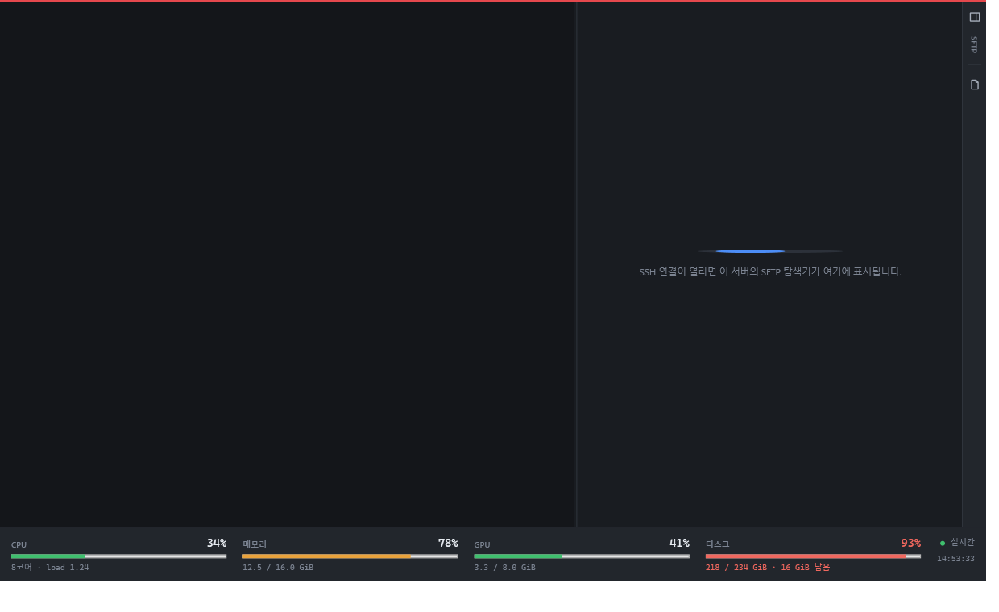

<div align="center">


# Limen

**A Windows SSH client that remembers your servers.**

Terminal, SFTP browser and saved credentials in one window — no install, no account, no telemetry.

[Download](#download) · [Build](#build-from-source) · [Security](#where-your-data-lives) · [한국어](README.ko.md)

</div>

---


*Latin* limen — a threshold. The point where you cross from one side to the other.

## Features

- **Session manager** — hosts organised into folders, with search. Double-click to connect.
- **Colour tags** — mark production red so you never mistake it for staging. The tag shows in the list, on the tab and as a strip above the terminal.
- **Saved credentials** — passwords and key passphrases encrypted with Windows DPAPI.
- **Jump hosts** — one-hop bastion tunnelling, with the bastion stored as an ordinary session.
- **Terminal** — xterm.js over SSH.NET. 256 colours, resize, interactive programs, scrollback search (<kbd>Ctrl</kbd>+<kbd>F</kbd>), font scaling (<kbd>Ctrl</kbd>+wheel).
- **SFTP** — split local/remote browser, recursive transfers, drag and drop to Explorer, rename and chmod. Deleting a folder runs one `rm -rf` on the server instead of a per-file walk, with a guard on the paths it will accept.
- **Live resource strip** — CPU, memory, GPU and disk for the connected host, coloured by severity.
- **Session recording** — write terminal output to a plain text file, escape codes stripped.
- **Safety rails** — multi-line pastes are confirmed before they reach the shell; host key changes are flagged.
- **Dark and light themes** — including the window frame and the terminal palette.
- **English and Korean** — switch at runtime from the toolbar.



## Download

Grab `Limen-x.y.z.exe` from [Releases](../../releases). It is self-contained —
no .NET runtime to install, nothing written to Program Files.

Windows 10 1809 or later, x64. The terminal renders through
[WebView2](https://developer.microsoft.com/microsoft-edge/webview2/), which ships
with current Windows.

> The executable is not code-signed, so SmartScreen will warn on first run.
> Choose **More info → Run anyway**, or build it yourself.

## Build from source

```
git clone https://github.com/LJW1216/limen-ssh
cd limen-ssh
dotnet build src/Limen/Limen.csproj
```

Requires the .NET 10 SDK. To produce the single-file release build:

```
dotnet publish src/Limen/Limen.csproj -c Release -r win-x64 ^
  --self-contained true -p:PublishSingleFile=true ^
  -p:IncludeNativeLibrariesForSelfExtract=true -o outputs/Limen
```

`src/Limen.UiTests` renders every screen to PNG and runs a few regression
checks (stored credentials surviving an edit, window placement persisting).
Run it with an output directory:

```
dotnet run --project src/Limen.UiTests -- ./shots
```

## Where your data lives

```
%APPDATA%\Limen\sessions.json   hosts, folders, colours, encrypted secrets
%APPDATA%\Limen\theme.txt       dark or light
%APPDATA%\Limen\language.txt    ko or en
%APPDATA%\Limen\window.json     window position and size
```

**Threat model, stated plainly.** Passwords and passphrases are encrypted with
Windows DPAPI scoped to the current user. That means the file is useless on
another machine or under another Windows account — and it also means anyone who
can run code as *you*, on *your* logged-in session, can decrypt them. There is
no master password. If that is not the trade you want, leave the password field
empty and Limen will ask on every connection.

Host keys are trust-on-first-use: the SHA256 fingerprint is shown on the first
connection, stored once you accept, and a change is reported before anything is
sent.

## Keyboard

| | |
|---|---|
| <kbd>Ctrl</kbd>+<kbd>N</kbd> | New session |
| <kbd>Ctrl</kbd>+<kbd>F</kbd> | Focus search — inside a terminal, search the scrollback |
| <kbd>Enter</kbd> | Open a terminal for the selected session |
| <kbd>F2</kbd> | Rename (session in the list, file in SFTP) |
| <kbd>Delete</kbd> | Delete the selected session |
| <kbd>Ctrl</kbd>+<kbd>W</kbd> | Close tab |
| <kbd>Ctrl</kbd>+<kbd>Tab</kbd> | Next tab |
| <kbd>F5</kbd> | Reload the session list |
| <kbd>Ctrl</kbd>+wheel | Terminal font size (<kbd>Ctrl</kbd>+<kbd>0</kbd> resets) |

## Known limitations

- One bastion hop. Chained `ProxyJump` is not implemented.
- No `ssh-agent` integration, agent forwarding, or X11 forwarding.
- SFTP transfers run one at a time.
- Terminal search does not match across a wrapped line.
- Windows only — WPF, DPAPI and WebView2 are all Windows-specific.

## Contributing

Issues and pull requests are welcome. A few things worth knowing:

- UI strings live in `src/Limen/scripts/i18n.py`, which is the single source of
  truth. Edit the map there and re-run it — it rewrites the XAML and regenerates
  `Services/Strings.Tables.cs`. Do not edit the generated file.
- Colours come from the token set in `Theme.xaml`, swapped at runtime by
  `ThemeManager`. Bind with `DynamicResource`, never a hard-coded brush.
- Anything security-adjacent — credential storage, host key handling — should
  come with a test in `src/Limen.UiTests`.

## Credits

Built on [SSH.NET](https://github.com/sshnet/SSH.NET) (MIT),
[BouncyCastle](https://www.bouncycastle.org/) (MIT),
[xterm.js](https://xtermjs.org/) (MIT) and the
[WebView2](https://developer.microsoft.com/microsoft-edge/webview2/) SDK.

The application icon was generated with OpenAI GPT-Image2.

## License

[MIT](LICENSE) for the code. The Limen name and the application icon are not
covered by it — fork the code freely, but please ship it under your own name and
mark.
